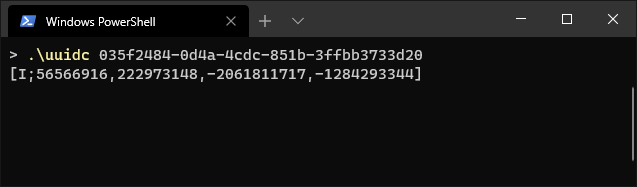

# minecraft-uuid-coverter
Converting UUID to the Minecraft 1.16+ int-array format.

## Usage:
```cmd
uuidc
```
Scans the current directory looking for uuids in files (don't do this if you don't know what you are doing)  
**Notice to me**: Stop making this the default behaviour, this is very bad for people who don't rtfm...

---

```cmd
uuidc <UUID>
```
Printing the converted UUID as an int array

---

```cmd
uuidc -uuid=<UUID>
```
Same as above but you have to write more

---

```cmd
uuidc <-flags>
```
Flags:
- `-uuid` - look above
- `-help` - no
- `-file=<file>` - specify a file which should be converted
- `-dir=<directory>` - specify a directory to scan
- `-ext=<extension>` - only include files with that extension (include the .)
- `-r` - scan directory recursive
- `-simulate` - don't do anything, theoretical changes are shown
